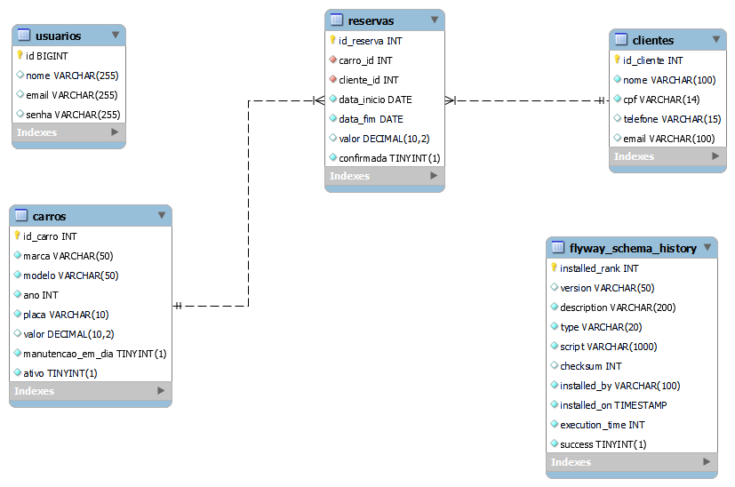
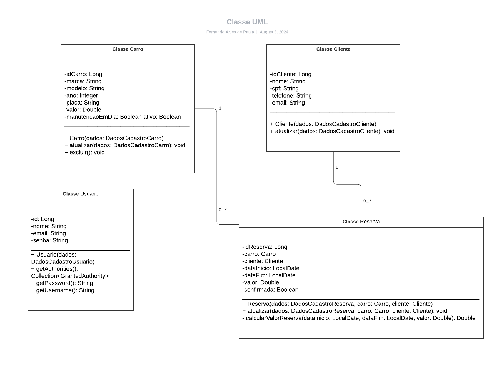

# Fahrt Wagen AG

## Escopo do Projeto

O projeto Fahrt Wagen AG é uma aplicação web projetada para gerenciar todos os aspectos operacionais de uma locadora de veículos. O escopo deste projeto abrange a criação de um sistema robusto e eficiente que permita a interação de usuários e administradores com os diversos elementos do serviço de locação. O projeto está dividido em módulos principais, cada um com suas responsabilidades específicas:

### 1. Autenticação de Usuários

Este módulo gerencia o processo de autenticação dos usuários, garantindo acesso seguro à plataforma. Os usuários poderão realizar login utilizando suas credenciais (email e senha). Após a validação das credenciais, um token de segurança será gerado para assegurar o acesso às funcionalidades da aplicação. Este módulo é essencial para proteger o sistema contra acessos não autorizados e manter a integridade das informações.

### 2. Gerenciamento de Carros

O módulo de gerenciamento de carros facilita a administração do inventário de veículos da locadora. Os administradores poderão adicionar novos veículos ao sistema, visualizar informações detalhadas sobre cada carro, atualizar dados existentes e remover veículos que não estão mais disponíveis. Este módulo inclui validações para garantir a precisão dos dados inseridos, como verificar a validade do ano de fabricação e a disponibilidade do veículo.

### 3. Gerenciamento de Clientes

Este módulo permite a administração detalhada dos dados dos clientes da locadora. Os administradores poderão listar todos os clientes, visualizar detalhes de clientes específicos, adicionar novos registros, atualizar informações existentes e remover clientes conforme necessário. A gestão eficaz dos dados dos clientes é crucial para manter a precisão e a relevância do banco de dados.

### 4. Gerenciamento de Reservas

O módulo de gerenciamento de reservas coordena todas as reservas de veículos feitas pelos clientes. Os administradores poderão visualizar reservas atuais e passadas, acessar detalhes específicos de cada reserva, realizar novas reservas e atualizar ou cancelar reservas existentes. Este módulo inclui um mecanismo de verificação de disponibilidade para assegurar que os veículos não sejam reservados de forma sobreposta.

### 5. Gerenciamento de Usuários

Este módulo foca na gestão dos usuários da plataforma. Os administradores poderão visualizar todos os usuários registrados, obter informações detalhadas sobre usuários específicos, adicionar novos usuários e atualizar suas informações. A gestão dos usuários é fundamental para garantir que as permissões e acessos sejam adequadamente configurados e monitorados.

### 6. Validações Específicas

O projeto inclui uma série de validações personalizadas para assegurar a integridade e a precisão dos dados. Isso envolve verificações para garantir a validade dos anos dos veículos, a ausência de duplicidades e a disponibilidade de carros para reserva. Essas validações são essenciais para manter a qualidade das informações no sistema e prevenir erros operacionais.

---



---



---

## Configuração do Projeto

1. Clone o repositório:

```bash
git clone https://github.com/seu-usuario/FahrtWagenApplication-ImpulsoGen.git
```

2. Navegue até o diretório do projeto:

```bash
cd FahrtWagenApplication-ImpulsoGen
```

3. Configure o banco de dados MySQL no `application.properties`:

```properties
spring.datasource.url=jdbc:mysql://localhost:3306/FahrtWagenApplication_DB
spring.datasource.username=seu-usuario
spring.datasource.password=sua-senha
spring.profiles.active=dev
```
## 🖱️ Requisições

Método | Requisição do Endpoint | Descrição |
------------ | ------------- | ------------ |
| POST | /login | Autenticar um usuário e gerar um token JWT |
| GET | /carros | Consultar todos os carros |
| GET | /carros/{id} | Consultar um carro por ID |
| POST | /carros | Cadastrar um novo carro |
| PUT | /carros/{id} | Atualizar um carro |
| DELETE | /carros/{id} | Deletar um carro por ID |
| GET | /clientes | Consultar todos os clientes |
| GET | /clientes/{id} | Consultar um cliente por ID |
| POST | /clientes | Cadastrar um novo cliente |
| PUT | /clientes/{id} | Atualizar um cliente |
| DELETE | /clientes/{id} | Deletar um cliente por ID |
| GET | /reservas | Consultar todas as reservas |
| GET | /reservas/{id} | Consultar uma reserva por ID |
| POST | /reservas | Cadastrar uma nova reserva |
| PUT | /reservas/{id} | Atualizar uma reserva |
| DELETE | /reservas/{id} | Deletar uma reserva por ID |
| GET | /usuarios | Consultar todos os usuários |
| GET | /usuarios/{id} | Consultar um usuário por ID |
| POST | /usuarios | Cadastrar um novo usuário |
| PUT | /usuarios/{id} | Atualizar um usuário |
---